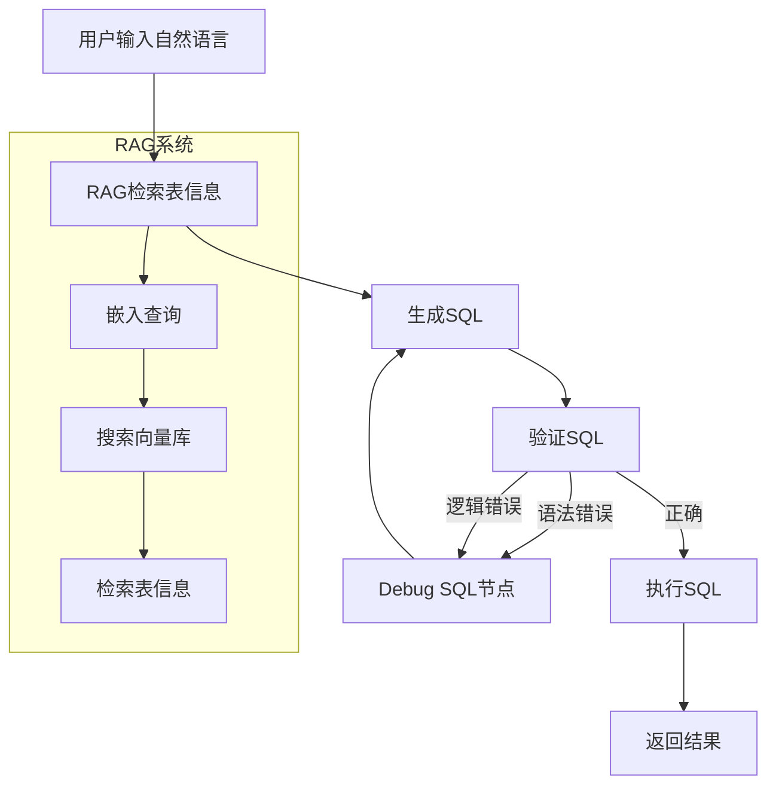

# Text-to-SQL 工作流设计文档

## 1. 需求分析

### 问题描述
用户需要将自然语言查询转换为MySQL SQL语句，并确保SQL的正确性和可执行性。系统需要：
- 理解用户意图并生成SQL
- 验证SQL语法和逻辑
- 提供错误反馈和自动修复
- 利用RAG系统检索相关表结构信息

### 适用场景
- 数据分析师快速查询数据库
- 业务人员无需学习SQL语法
- 数据库查询自动化
- 报表生成和数据分析

## 2. 流程设计

### 设计模式选择
采用 **Workflow + Agent + RAG** 混合模式：
- **Workflow**：固定的SQL生成和验证流程
- **Agent**：动态决策是否需要修复SQL
- **RAG**：检索相关表结构信息

### 核心流程


## 3. 工具函数设计

### 3.1 MySQL连接工具
- **文件**: `utils/mysql_connector.py`
- **功能**: 连接MySQL数据库，执行SQL，获取表结构
- **输入**: 数据库配置，SQL语句
- **输出**: 查询结果，错误信息

### 3.2 Milvus Lite向量数据库
- **文件**: `utils/milvus_lite.py`
- **功能**: 存储和检索表结构信息的向量表示
- **输入**: 文本内容
- **输出**: 向量嵌入，相似度搜索结果

### 3.3 SQL验证工具
- **文件**: `utils/sql_validator.py`
- **功能**: 验证SQL语法，检查表名和字段名
- **输入**: SQL语句，数据库schema
- **输出**: 验证结果，错误详情

### 3.4 LLM调用工具
- **文件**: `utils/call_llm.py`
- **功能**: 调用大语言模型生成和修复SQL
- **输入**: 提示词
- **输出**: 生成的SQL或修复建议

## 4. 数据设计

### 共享存储结构
```python
shared = {
    "user_query": "查询所有用户的订单数量",
    "database_config": {
        "host": "localhost",
        "port": 3306,
        "database": "ecommerce",
        "user": "user",
        "password": "password"
    },
    "rag_context": {
        "table_info": [
            {
                "table_name": "users",
                "columns": ["id", "name", "email"],
                "description": "用户表"
            }
        ],
        "similarity_scores": [0.85, 0.72]
    },
    "sql_generation": {
        "initial_sql": "SELECT COUNT(*) FROM orders",
        "current_sql": "SELECT COUNT(*) FROM orders",
        "validation_errors": [],
        "execution_result": None
    },
    "debug_history": [
        {
            "iteration": 1,
            "sql": "SELECT COUNT(*) FROM orders",
            "error": "Table 'orders' doesn't exist",
            "fix_suggestion": "Use 'user_orders' table instead"
        }
    ]
}
```

## 5. 节点设计

### 5.1 RAG检索节点 (RAGRetrievalNode)
- **类型**: Regular Node
- **prep**: 读取用户查询和数据库配置
- **exec**: 调用Milvus Lite检索相关表信息
- **post**: 将检索结果写入shared["rag_context"]

### 5.2 SQL生成节点 (SQLGenerationNode)
- **类型**: Regular Node
- **prep**: 读取用户查询和RAG上下文
- **exec**: 调用LLM生成SQL语句
- **post**: 将生成的SQL写入shared["sql_generation"]["current_sql"]

### 5.3 SQL验证节点 (SQLValidationNode)
- **类型**: Regular Node
- **prep**: 读取当前SQL和数据库schema
- **exec**: 验证SQL语法和逻辑
- **post**: 根据验证结果返回不同action

### 5.4 SQL调试节点 (SQLDebugNode)
- **类型**: Regular Node
- **prep**: 读取验证错误和调试历史
- **exec**: 分析错误并生成修复建议
- **post**: 更新调试历史，返回修复后的SQL

### 5.5 SQL执行节点 (SQLExecutionNode)
- **类型**: Regular Node
- **prep**: 读取验证通过的SQL
- **exec**: 执行SQL并获取结果
- **post**: 将结果写入shared["sql_generation"]["execution_result"]

## 6. 实现计划

### 阶段1: 基础工具函数
1. 实现MySQL连接器
2. 实现Milvus Lite集成
3. 实现SQL验证器
4. 实现LLM调用工具

### 阶段2: 核心节点
1. 实现RAG检索节点
2. 实现SQL生成节点
3. 实现SQL验证节点
4. 实现SQL执行节点

### 阶段3: 调试系统
1. 实现SQL调试节点
2. 实现循环逻辑
3. 添加调试历史记录

### 阶段4: 优化和测试
1. 优化提示词工程
2. 添加错误处理
3. 性能测试和优化

## 7. 技术栈

- **框架**: PocketFlow
- **数据库**: MySQL
- **向量数据库**: Milvus Lite
- **LLM**: OpenAI GPT-4 或 Claude
- **SQL解析**: SQLAlchemy + MySQL Connector
- **向量嵌入**: OpenAI Embeddings

## 8. 预期效果

- **准确性**: 90%以上的SQL生成准确率
- **响应时间**: 平均3-5秒完成查询
- **错误修复**: 自动修复80%的常见SQL错误
- **用户体验**: 自然语言输入，结构化结果输出

## 9. 风险评估

- **LLM依赖**: 需要稳定的API访问
- **数据库安全**: 需要严格的权限控制
- **性能瓶颈**: 向量检索可能成为性能瓶颈
- **错误处理**: 复杂查询的错误修复可能不够准确

---

请审核此设计文档，如有需要修改的地方请告知。
